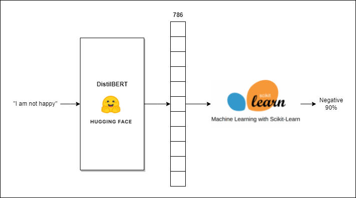

# Bert embeddings sentiment analysis

<p align="center">

</p>

## Part I. Install requirements & train model

- Docker (https://docs.docker.com/get-docker)
- Git (https://git-scm.com/downloads)

### 1. Go to project dir

```shell
git clone https://github.com/Jason-Oleana/bert-embeddings-sentiment-analysis.git
cd bert-embeddings-sentiment-analysis
```

### 2. Docker build image

```shell
docker build -t notebook .
```
wait...

###  3. Docker run container

#### For Windows Users
```shell
docker run -p 8888:8888 -v %cd%/models:/work/models notebook
```

#### For MacOS & Linux Users
##### step 1
```shell
sudo chown -R 1000 models/
```
##### step 2
```shell
docker run -p 8888:8888 -v "$(pwd)"/models:/work/models notebook
```

### 6. Run machine learning notebook
- Copy and paste http://127.0.0.1:8888/lab?token=[insert-token]
- Open notebooks
- Open BERT_mlp_model.ipynb
- Run notebook before proceeding to part 2
- Make sure the model is succesfully saved

## Part 2. Serve model with FastAPI

### 1. Docker build image

```shell
docker build -t mlapp ./fastapi
``` 
wait...

###  2. Docker run container

#### For Windows Users
```shell
docker run -p 8000:8000 -v %cd%/models:/app/models -v %cd%/fastapi:/app mlapp
```

#### For MacOS Users
```shell
docker run -p 8000:8000 -v "$(pwd)"/models:/app/models -v "$(pwd)"/fastapi:/app mlapp
```

###  3. Test the model
- Open a browser
- Go to localhost:8000/docs

### Handy Docker commands

##### 1. Show running containers
```shell
docker ps
```

##### 2. Show Docker images
```shell
docker images
```

##### 3. stop container
```shell
docker stop [container-id]
```

##### 4. Remove image
```shell
docker rmi [image-id]
```

or

```shell
docker rmi -f [image-id]
```
